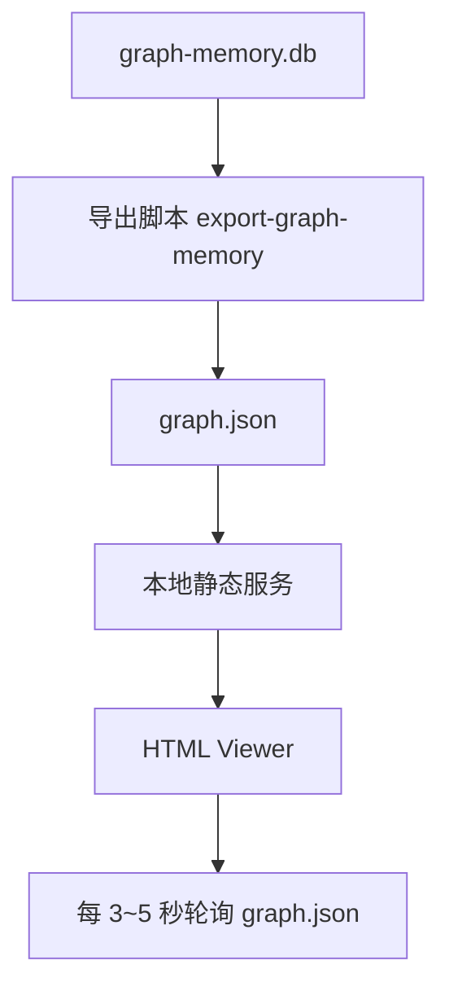

# Graph Memory Viewer 技术方案 v1

> 目标：为 OpenClaw 的 `graph-memory` 插件提供一个“接近 live”的本地可视化页面，用于查看节点（nodes）、边（edges）和后续 community 聚类结果。

---

## 1. 项目目标

本项目要解决的不是“做一个漂亮网页”这么简单，而是解决以下实际问题：

1. **让图谱状态可见**
   - 直观看到 `gm_nodes`、`gm_edges`、`gm_communities` 的变化
   - 看到具体节点和边，而不是只看统计数字

2. **支持接近 live 的观察体验**
   - 当数据库刷新后，页面能在数秒内反映变化
   - 适合排障、验证抽取效果、观察图谱增长

3. **尽量轻量、稳、低耦合**
   - 不直接改 `graph-memory` 插件源码
   - 不依赖 OpenClaw 内部私有 UI
   - 用最少组件先跑通链路

---

## 2. 非目标（先不做）

以下内容不属于 v1 必做范围：

- 真正的 websocket 推送式实时同步
- 复杂权限系统 / 多用户登录
- 直接在网页内编辑节点、边、community
- 3D 图谱
- 超大规模图数据性能优化（10w+ 节点）
- 和 OpenClaw 主界面深度嵌入

v1 的目标是：**先把“可看、可刷新、可排障”做出来。**

---

## 3. 对 live 的定义

这里的“live”不定义为毫秒级数据库推送，而定义为：

> 数据库变化后，页面通过轮询拉取最新导出 JSON，在 **3~5 秒** 内自动刷新并更新图谱展示。

也就是：

- **不是** 真正 DB → browser 直连
- **不是** websocket 真实时推送
- **而是** “准实时轮询刷新”

这是成本最低、最稳、最适合当前场景的方案。

---

## 4. 推荐整体架构



### 架构分层

#### 4.1 数据源层
- SQLite 数据库：`graph-memory.db`
- 核心表：
  - `gm_nodes`
  - `gm_edges`
  - `gm_communities`

#### 4.2 导出层
- 一个独立脚本读取 SQLite
- 导出为前端友好的 `graph.json`
- 页面不直接碰数据库

#### 4.3 展示层
- 一个本地 HTML 页面
- JS 加载 `graph.json`
- 使用图谱可视化库渲染

#### 4.4 刷新层
- 前端每 3~5 秒拉取一次 `graph.json`
- 检测数据变化后更新视图

---

## 5. 为什么不让浏览器直连 sqlite

原因如下：

1. **浏览器安全模型限制**
   - 浏览器不适合直接读取本地 sqlite 文件
   - 直连会引入额外权限、兼容性和安全问题

2. **工程复杂度不划算**
   - 为了“直连 DB”要引入更多复杂桥接层
   - 对当前目标没有必要

3. **导出 JSON 更通用**
   - 前端和数据层解耦
   - 便于调试、缓存、扩展
   - 后续想接 API / websocket 也容易升级

结论：**v1 采用 sqlite → json → html 的桥接模式。**

---

## 6. 目录结构建议

项目统一放在：

```text
projects/graph-memory-viewer/
├── README.md
├── TECH-SPEC-v1.md
├── viewer/
│   ├── index.html
│   ├── app.js
│   ├── styles.css
│   └── lib/
├── data/
│   └── graph.json
├── scripts/
│   └── export-graph-memory.js
└── package.json   (可选)
```

### 说明
- `viewer/`：前端页面
- `data/graph.json`：导出的图数据
- `scripts/export-graph-memory.js`：从 sqlite 导出 json
- `README.md`：运行方式

如果想再轻一点，也可以不做 `package.json`，直接单页面 + 原生 JS。

---

## 7. 技术选型建议

### 7.1 前端图谱库
优先推荐以下二选一：

#### 方案 A：`vis-network`
优点：
- 上手快
- 力导向图开箱即用
- 适合中小规模节点图
- 交互比较直接

缺点：
- 样式自由度一般
- 大图性能一般

#### 方案 B：`cytoscape.js`
优点：
- 更专业的图数据可视化
- 样式控制更强
- 以后扩展筛选/布局更灵活

缺点：
- 稍复杂一点

### 建议
**v1 优先用 `vis-network`。**
原因：更快出结果，更适合先验证链路。

---

## 8. 数据模型设计

前端不要直接使用数据库原始结构，统一转成标准 JSON。

### 8.1 graph.json 顶层结构

```json
{
  "meta": {
    "generatedAt": "2026-03-29T18:00:00+08:00",
    "sourceDb": "/home/trinity/.openclaw/graph-memory.db",
    "nodeCount": 23,
    "edgeCount": 8,
    "communityCount": 0,
    "version": 1
  },
  "nodes": [],
  "edges": [],
  "communities": []
}
```

---

### 8.2 nodes schema

```json
{
  "id": "node-123",
  "label": "openclaw-json-config-edit",
  "type": "skill",
  "description": "在 openclaw.json 中编辑插件配置",
  "communityId": null,
  "pagerank": 0.18,
  "degree": 3,
  "raw": {}
}
```

字段说明：

| 字段 | 含义 |
|---|---|
| `id` | 节点唯一 ID |
| `label` | 页面展示名称 |
| `type` | 节点类型，如 skill/task/event/person/concept |
| `description` | 节点描述 |
| `communityId` | 所属社区，可为空 |
| `pagerank` | 权重，可用于节点大小 |
| `degree` | 度数，可选 |
| `raw` | 保留原始记录，方便调试 |

---

### 8.3 edges schema

```json
{
  "id": "edge-001",
  "source": "node-123",
  "target": "node-456",
  "label": "USED_SKILL",
  "weight": 1,
  "raw": {}
}
```

字段说明：

| 字段 | 含义 |
|---|---|
| `id` | 边唯一 ID |
| `source` | 起点节点 ID |
| `target` | 终点节点 ID |
| `label` | 边类型，如 USED_SKILL / SOLVED_BY |
| `weight` | 可视化权重 |
| `raw` | 原始记录 |

---

### 8.4 communities schema

```json
{
  "id": "community-01",
  "label": "OpenClaw 配置与 embedding",
  "color": "#4F46E5",
  "size": 8
}
```

当 `gm_communities = 0` 时，`communities` 返回空数组即可，前端必须兼容。

---

## 9. 页面功能清单（v1 必做）

### 9.1 图谱主视图
- 展示所有 nodes
- 展示所有 edges
- 支持拖拽、缩放、平移

### 9.2 节点视觉编码
- **颜色**：按 `type` 区分
- **大小**：按 `pagerank` 或默认值区分
- **标签**：展示 `label`

建议颜色映射：

| type | color |
|---|---|
| skill | 蓝色 |
| task | 绿色 |
| event | 橙色 |
| concept/unknown | 灰色 |

### 9.3 边视觉编码
- 显示连接线
- 可选显示方向箭头
- 可在 hover 或点击时显示 `label`

### 9.4 右侧详情面板
点击节点后展示：
- 节点名称
- 节点类型
- 描述
- communityId
- pagerank
- 关联边数量
- 原始数据（可折叠）

### 9.5 顶部统计栏
至少显示：
- Node count
- Edge count
- Community count
- Last updated time

### 9.6 自动刷新
- 每 5 秒请求一次 `graph.json`
- 如果 `generatedAt` 变化，则更新图谱
- 页面显示“最后刷新时间”

---

## 10. 页面功能清单（v2 推荐）

以下不是 v1 硬性要求，但很推荐顺手预留：

1. 节点搜索框
2. 按类型筛选节点
3. 按 community 筛选
4. 高亮某个节点的一阶邻居
5. 点击边显示关系详情
6. 暂停自动刷新按钮
7. 手动刷新按钮

---

## 11. 数据导出逻辑

导出脚本职责：

1. 连接 sqlite
2. 查询 `gm_nodes`
3. 查询 `gm_edges`
4. 查询 `gm_communities`
5. 转换为统一 JSON schema
6. 输出到 `data/graph.json`

### 11.1 导出原则
- 前端需要什么字段，就导什么字段
- 不要把 DB 内部结构原样裸抛给前端
- 缺失字段时给安全默认值

### 11.2 容错要求
- `gm_communities` 为空时不报错
- 某个 edge 指向不存在节点时，记录 warning 并跳过
- 某些字段为空时，前端仍能显示

---

## 12. 刷新机制设计

### 12.1 简单版（推荐 v1）
前端：
- `setInterval(fetchGraph, 5000)`
- 拉取 `graph.json?ts=<timestamp>` 防缓存
- 若 `meta.generatedAt` 变化，则重绘图谱

### 12.2 更稳一点的版本
前端：
- 先拉新 JSON
- 比较 node/edge 总数、`generatedAt`
- 只有变化时才更新画布

### 12.3 不建议 v1 就上 websocket
原因：
- 成本高
- 当前需求没必要
- 轮询已经足够达成“接近 live”

---

## 13. 性能与体验建议

### 13.1 布局
- 首选力导向布局
- 更新时尽量不要每次完全重置节点位置（如果库支持）
- 若实现复杂，v1 可以接受完全重绘

### 13.2 刷新频率
- 默认 **5 秒**
- 可允许用户改成 3 秒 / 10 秒
- 不建议低于 2 秒，避免无意义消耗

### 13.3 大小映射
节点大小建议：
- 有 `pagerank`：按 pagerank 映射到 12~40 px
- 没有 `pagerank`：统一 18 px

### 13.4 文本显示
- 默认只显示核心 label
- 长 description 放右侧面板，不直接堆到图里

---

## 14. 实现阶段建议

### Phase 1：静态可视化
目标：
- 能读 `graph.json`
- 能展示 nodes / edges
- 能点击节点看详情

### Phase 2：自动刷新
目标：
- 每 5 秒自动刷新
- 顶部显示 last updated
- 数据变化后自动重绘

### Phase 3：筛选与搜索
目标：
- 类型筛选
- 搜索节点
- 高亮邻居

### Phase 4：community 增强
目标：
- community 颜色映射
- group / cluster 视图

---

## 15. 验收标准

实现完成后，必须满足：

### 基础验收
- [ ] 页面能正常打开
- [ ] 能读取 `graph.json`
- [ ] 能显示 nodes 和 edges
- [ ] 节点点击后能显示详情
- [ ] 顶部能看到统计信息

### live 体验验收
- [ ] 页面每 5 秒自动轮询
- [ ] 数据更新后页面能在 5 秒左右反映变化
- [ ] `gm_communities = 0` 时页面不报错
- [ ] 缺失 description / pagerank 时页面不崩

### 工程验收
- [ ] 项目结构清晰
- [ ] README 能指导运行
- [ ] 代码不依赖私有硬编码路径（或仅把路径集中配置）
- [ ] 不修改 OpenClaw 核心源码

---

## 16. 风险点

### 风险 1：数据库字段结构和预期不一致
应对：
- 导出脚本里做字段映射层
- 不让前端直接依赖底层 DB 表结构

### 风险 2：图谱库渲染效果一般
应对：
- v1 先以可用为主
- 后续如果觉得不好看，再换 `cytoscape.js`

### 风险 3：每次刷新重绘导致体验抖动
应对：
- v1 允许
- v2 再做增量更新 / 节点位置保持

### 风险 4：community 长期为空
应对：
- 页面设计必须把 community 视为可选增强字段，而不是硬依赖

---

## 17. 后续升级路线

如果 v1 跑顺了，可以继续升级：

1. 导出脚本改成轻量 HTTP API
2. 页面支持 websocket 推送
3. 节点/边增量动画更新
4. 社区聚类专门视图
5. 时间维度回放（图谱随时间演化）
6. 支持从页面跳转到对应 message / source

---

## 18. 给编码模型的明确实现约束

请编码模型严格遵守以下约束：

1. **不要改动 OpenClaw 主程序源码**
2. **不要假设浏览器可直接读取 sqlite**
3. **先做 sqlite → json → html 方案**
4. **优先选择 vis-network**
5. **前端使用原生 HTML/CSS/JS 即可，不必引入复杂框架**
6. **必须兼容 `gm_communities = 0`**
7. **必须提供 README，写清运行方式**
8. **代码目录按本方案组织**
9. **默认轮询间隔 5 秒**
10. **不要过度设计，先把 v1 跑通**

---

## 19. 建议的最小交付物

编码模型至少要产出：

1. `viewer/index.html`
2. `viewer/app.js`
3. `viewer/styles.css`
4. `scripts/export-graph-memory.js`
5. `data/graph.json`（示例或运行产物）
6. `README.md`

---

## 20. 一句话结论

这个 viewer 的正确路线不是“硬上真 live”，而是：

> **先用 sqlite → json → html + 5 秒轮询，做一个稳定、低成本、接近 live 的图谱观察器。**

这是当前最务实、最省 token、最容易让便宜模型高质量落地的方案。
